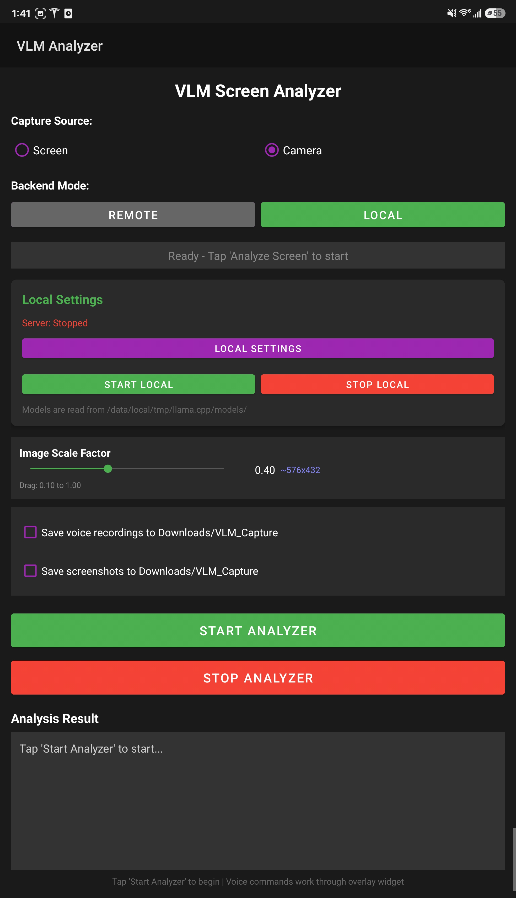
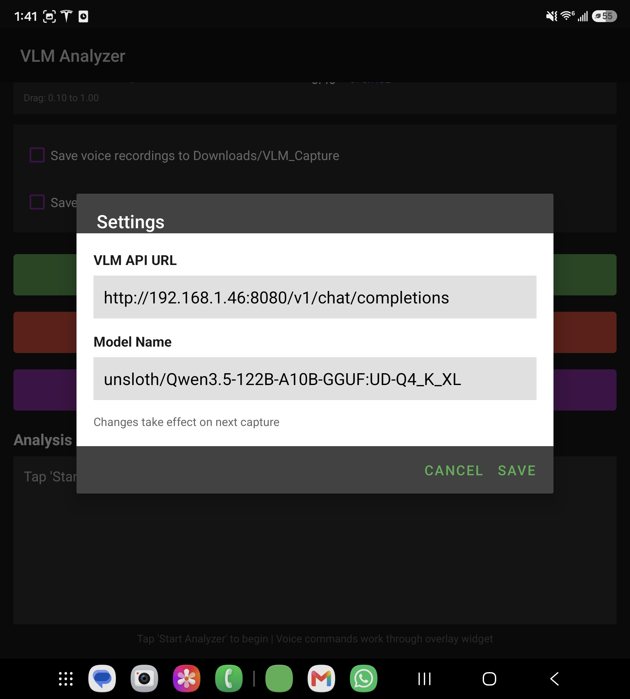
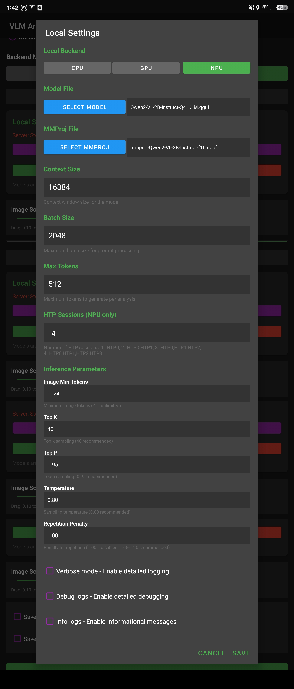
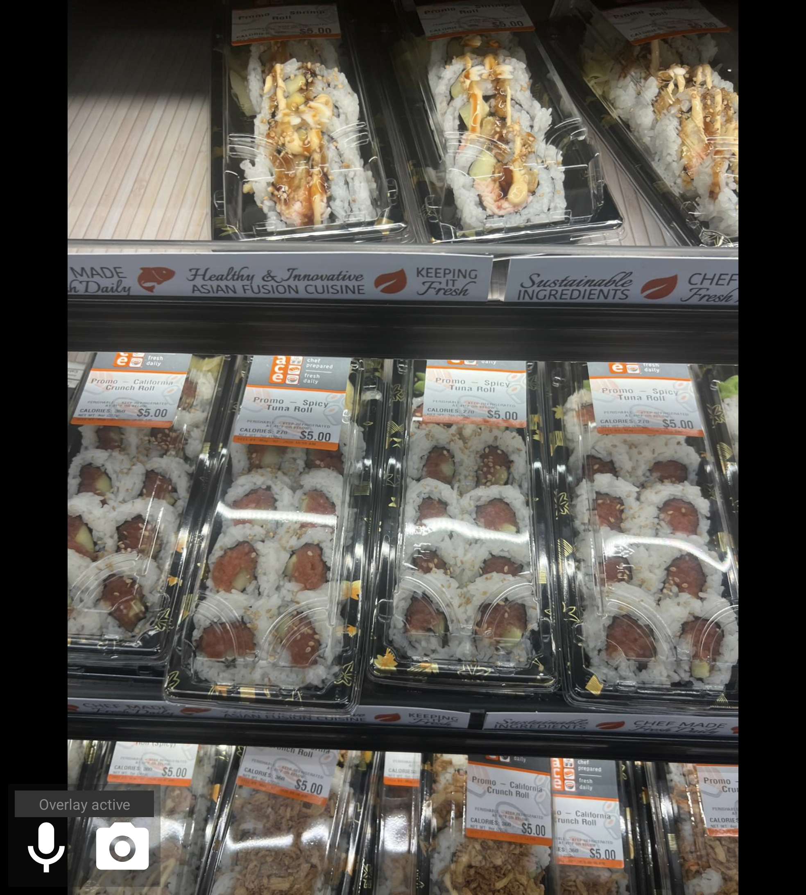
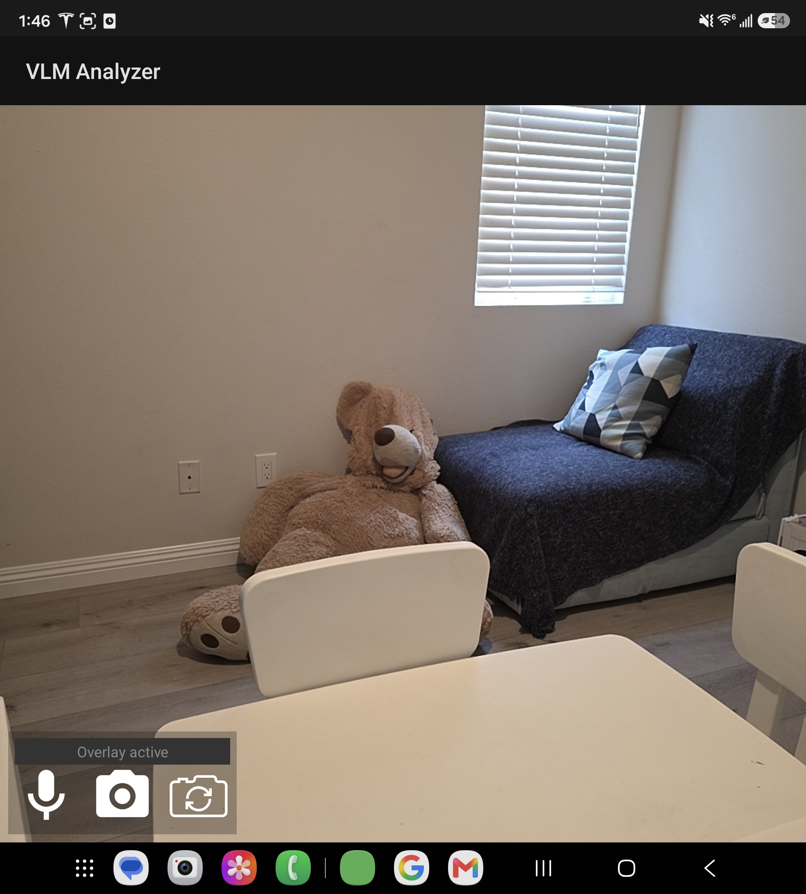
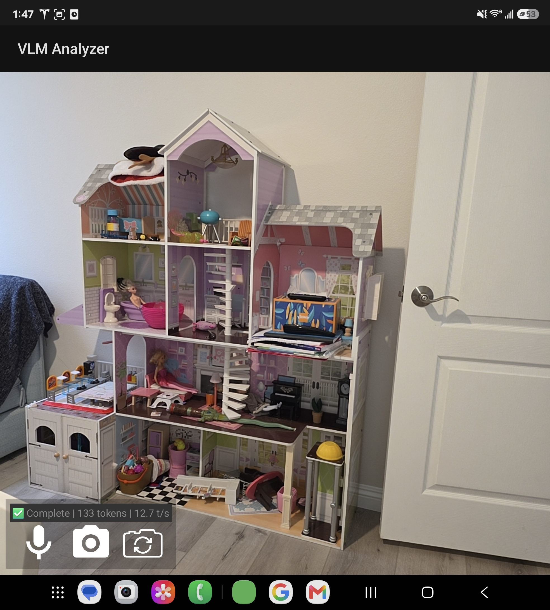
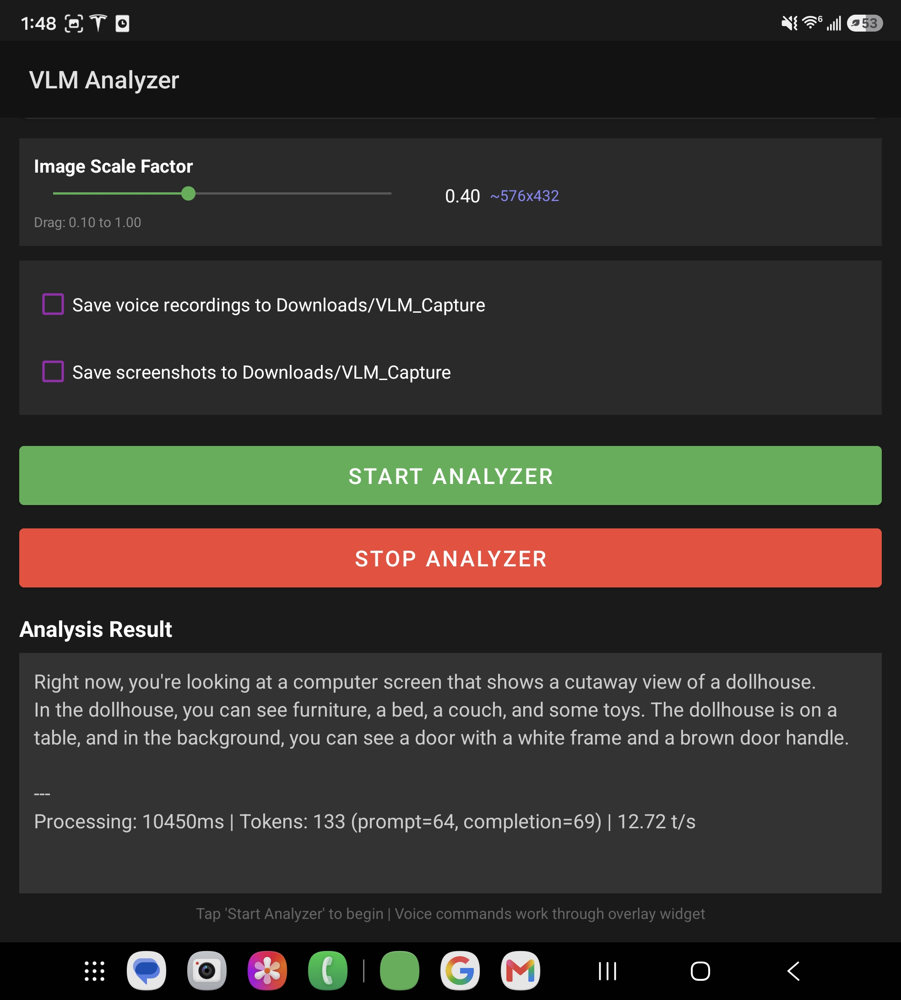

# LLAMA VLM Android

A mobile screen capture and analysis tool that uses Vision Language Models (VLM) to analyze what's on your screen. Remote mode uses [llama.cpp](https://github.com/ggml-org/llama.cpp) server API; local mode uses a custom JNI wrapper built on top of llama.cpp's [mtmd-cli](https://github.com/ggml-org/llama.cpp/tree/master/tools/mtmd) multimodal inference engine. Offline text-to-speech powered by [sherpa-onnx](https://github.com/k2-fsa/sherpa-onnx).

Supports local acceleration with CPU (ARM cores), GPU (Adreno via [OpenCL](https://www.khronos.org/opencl/)), or NPU (Hexagon HTP, using [Hexagon SDK](https://softwarecenter.qualcomm.com/api/download/software/sdks/Hexagon_SDK/Windows/6.6.0.0/Hexagon_SDK_WinNT.zip)).

**Development:** This repository was fully developed using [Claude CLI](https://claude.ai/code) with local llama.cpp server running the `unsloth/Qwen3.5-122B-A10B-GGUF:UD-Q4_K_XL` model ([HuggingFace](https://huggingface.co/unsloth/Qwen3.5-122B-A10B-GGUF)).


---

## Table of Contents

- [Features](#features)
- [Architecture](#architecture)
- [Installation](#installation)
- [Usage](#usage)
  - [Backend Modes](#backend-modes)
  - [Capture Sources](#capture-sources)
  - [Remote Mode](#remote-mode)
  - [Local Mode](#local-mode)
- [Configuration](#configuration)
- [Model Setup](#model-setup)
- [Performance](#performance)
- [Troubleshooting](#troubleshooting)
- [Build Documentation](#build-documentation)

---

## Features

### Core Capabilities

- **Screen Capture**: Real-time screen capture with overlay controls
- **Camera Capture**: Front/back camera streaming with tap-to-capture
- **Visual Analysis**: Ask questions about what's on your screen
- **Offline TTS**: Text-to-speech output using offline engine
- **Streaming Response**: Real-time token streaming from VLM

### Backend Options

| Mode   | Description                         | Use Case                                |
|--------|-------------------------------------|-----------------------------------------|
| REMOTE | Connects to remote llama.cpp server | Fast setup, cloud processing            |
| LOCAL  | On-device inference with llama.cpp  | Offline use, privacy, no network needed |


### Local Backend Acceleration

| Backend | Hardware        | Performance (Fold 7)     |
|---------|-----------------|--------------------------|
| CPU     | ARM cores       | ~4.8 tk/s (baseline)     |
| NPU     | Hexagon HTP     | ~9.9 tk/s (2x vs CPU)    |
| GPU     | Adreno (OpenCL) | ~12.5 tk/s (2.6x vs CPU) |


---

## Architecture

```
┌─────────────────────────────────────────────────────────────┐
│                     LLAMA VLM Android                       │
├─────────────────────────────────────────────────────────────┤
│  MainActivity                                               │
│  ├── Mode Selection (REMOTE / LOCAL)                        │
│  ├── Capture Source (Screen / Camera)                       │
│  └── Settings Configuration                                 │
├─────────────────────────────────────────────────────────────┤
│  ScreenCaptureService    │  CameraCaptureActivity           │
│  ├── Screen Capture     │  ├── Camera Preview               │
│  ├── Overlay Controls   │  ├── Frame Capture                │
│  └── Inference Routing  │  └── YUV→RGB Conversion           │
├─────────────────────────────────────────────────────────────┤
│  VlmAnalyzer                                                │
│  ├── Image Encoding (JPEG/base64 for REMOTE)                │
│  ├── API Client (remote HTTP)                               │
│  └── Local Inference Backend (LOCAL mode)                   │
├─────────────────────────────────────────────────────────────┤
│  LocalInferenceBackend (LOCAL mode only)                    │
│  ├── libmtmd-inference-jni.so (JNI wrapper)                 │
│  ├── libllama.so + libmtmd.so (multimodal inference)        │
│  └── Backends: CPU / GPU (OpenCL) / NPU (Hexagon HTP)       │
├─────────────────────────────────────────────────────────────┤
│  TtsHelper (Offline TTS)                                    │
│  └── Text-to-speech for results                             │
└─────────────────────────────────────────────────────────────┘
```

---

## Installation

### Quick Start

1. **Download APK**: Get the latest release from the releases page
2. **Install**: Enable "Install from Unknown Sources" if needed
3. **Launch**: Open the app and grant required permissions

### Build from Source

See [SETUP.md](SETUP.md) for complete build instructions.

**Prerequisites:**
- MSYS2 UCRT64 environment (required for building llama.cpp)
- Android SDK with NDK 25.1.8937393
- Java JDK 17+
- Hexagon SDK 6.6.0.0 ([Download](https://softwarecenter.qualcomm.com/api/download/software/sdks/Hexagon_SDK/Windows/6.6.0.0/Hexagon_SDK_WinNT.zip)) - for NPU support

**Quick Build:**
```bash
# MSYS2 UCRT64 terminal
cd VLM-Analyze-Android
source ./setup-config.sh    # Configure paths
./buildAPK.sh -All -install # Build and install
```

---

## Usage


*Main activity - select backend mode (REMOTE/LOCAL) and capture source (Screen/Camera)*

### Backend Modes

The app supports two backend modes for VLM inference:

#### REMOTE Mode (Cloud API)

Connects to a remote llama.cpp server running on another machine.

**Setup:**
1. Launch a llama.cpp server with multimodal support:
   
   **Example with Qwen3.5-122B (recommended for powerful servers):**
   ```bash
   llama-server -hf unsloth/Qwen3.5-122B-A10B-GGUF:UD-Q4_K_XL \
                -c 262144 --host 0.0.0.0 -ngl all --no-mmap \
                --fit-ctx 32768 --flash-attn on \
                --reasoning-format auto --temp 0.6 --top-p 0.95 \
                --top-k 20 --min-p 0.00 \
                --presence_penalty 0.0 --repeat-penalty 1.0 \
                --chat-template-file qwen3.5_chat_template.jinja
   ```
   
   **Example with Qwen2-VL-2B (lightweight):**
   ```bash
   llama-server -hf bartowski/Qwen2-VL-2B-Instruct-GGUF \
                -m Qwen2-VL-2B-Bartowski-Q4_K_M.gguf \
                --mmproj mmproj-f16.gguf \
                -c 16384 --host 0.0.0.0 -ngl 999
   ```
   
   **Supported models:** Any gguf multimodal model compatible with llama.cpp

2. In the app:
   - Tap "REMOTE" mode button
   - Tap "Settings" to configure API URL
   - Default: `http://localhost:8080/v1/chat/completions`

**Pros:**
- Broad Compatibility
- Can use larger models (70B+, 122B+)
- Best quality with powerful models

**Cons:**
- Requires network connection
- Server setup required

**Configuration:**
- **API URL**: Endpoint for llama.cpp server
- **Model**: Model name (for display/reference)

**Note:** Image Scale is controlled via slider. Separate values for Screen and Camera capture. Lower values = faster processing, less detail.

**Usage:**
1. Select "REMOTE" mode
2. Configure API URL in Settings
3. Start capture (screen or camera)
4. Tap capture to send image to server
5. View streaming response


*Remote mode settings - configure API URL and model name*

#### LOCAL Mode (On-Device)

Runs inference directly on your Android device using llama.cpp.

**Setup:**
1. See [Model Setup](#model-setup) for pushing models to device
2. In the app:
   - Tap "LOCAL" mode button
   - Tap "Local Settings" to configure
   - Select model and mmproj paths
   - Choose backend (CPU/GPU/NPU)
   - Tap "Start Local" to load the model

**Pros:**
- Works offline
- No network latency
- Privacy (data stays on device)

**Cons:**
- Limited by device capacity
- Quality may drop

**Configuration:**
- **Model Path**: Path to `.gguf` model file
- **MMProj Path**: Path to multimodal projector file
- **Backend**: CPU, GPU (Adreno), or NPU (Hexagon HTP)
- **Context Size**: Token context window (default: 16384)
- **Batch Size**: Processing batch size (default: 512)
- **HTP Sessions**: Number of Hexagon sessions (1-4, for NPU)
- **Inference Params**: top-k, top-p, temperature, repetition penalty

**Usage:**
1. Select "LOCAL" mode
2. Tap "Local Settings"
3. Configure model, mmproj, and backend
4. Tap "Start Local" to load model
5. Start capture (Screen or Camera) and analyze


*Local mode settings - configure model path, mmproj, backend (CPU/GPU/NPU), and inference parameters*

**Note:** Both Screen and Camera capture sources work in REMOTE and LOCAL modes.

### Capture Sources

#### Screen Capture

Analyze what's displayed on your screen. Works in both REMOTE and LOCAL modes.

**Steps:**
1. Select "Screen" in capture source
2. Tap "Start Analyzer"
3. Grant screen capture permission (one-time)
4. Grant overlay permission (for floating controls)
5. Tap "Capture" on the floating overlay to analyze

**Features:**
- Real-time screen capture
- Floating overlay with capture button
- Results displayed on overlay
- Voice output via TTS


*Floating overlay during screen capture - tap camera icon to capture, or microphone to ask voice questions like "What is on my screen?"*

#### Camera Capture

Analyze what the camera sees. Works in both REMOTE and LOCAL modes.

**Steps:**
1. Select "Camera" in capture source
2. Tap "Start Analyzer"
3. Grant camera permission
4. Camera preview opens
5. Tap capture button to analyze current frame

**Features:**
- Live camera preview at 30 FPS
- Front/back camera toggle
- Tap-to-capture analysis
- Streaming pauses during analysis
- Auto-detected camera resolution


*Same functionality as screen capture (camera icon to capture, microphone for voice questions) plus camera toggle icon to swap front/back camera*


*Analysis result displayed on overlay after capture*


*Full analysis text returned by the VLM model, displayed in the main activity*

---

## Configuration

### Main Settings (REMOTE Mode)

| Setting | Description               | Default                                    |
|---------|---------------------------|--------------------------------------------|
| API URL | Remote server endpoint    | `http://localhost:8080/v1/chat/completions`|
| Model   | Model name (display only) | `unsloth/Qwen3.5-122B-A10B-GGUF:UD-Q4_K_XL`|

### General Settings (Both Modes)

| Setting      | Description                    | Default |
|--------------|--------------------------------|---------|
| Image Scale (Screen) | Screen capture resolution (slider) | 0.4   |
| Image Scale (Camera) | Camera capture resolution (slider) | 0.25  |


### Local Settings (LOCAL Mode)

| Setting            | Description               | Default     |
|--------------------|---------------------------|-------------|
| Model Path         | Path to `.gguf` model     | -           |
| MMProj Path        | Path to projector file    | -           |
| Backend            | CPU / GPU / NPU           | CPU         |
| Context Size       | Token context window      | `16384`     |
| Batch Size         | Processing batch size     | `512`       |
| HTP Sessions       | Hexagon sessions (NPU)    | `1`  * HTP Sessions is Device-dependent: Samsung Fold 7 supports up to 4, Samsung Flip 6 supports 1 only*       |
| Image Min Tokens   | Minimum image tokens      | `-1` (auto) |
| Top-k              | Sampling top-k            | `40`        |
| Top-p              | Sampling top-p            | `0.95`      |
| Temperature        | Sampling temperature      | `0.80`      |
| Repetition Penalty | Repetition penalty        | `1.00`      |

 

### Other Settings

| Setting          | Description                | Default |
|------------------|----------------------------|---------|
| Save Audio       | Save audio recordings      | `false` |
| Save Screenshots | Save captured screenshots  | `false` |

### Logging

Enable debug or info logs for troubleshooting:
- **Debug Logs**: Detailed operation logs
- **Info Logs**: Component-specific logs

---

## Model Setup

### Required Files

For multimodal VLM inference, you need:

1. **Model File** (`.gguf`): The VLM model weights
2. **MMProj File** (`.gguf`): Multimodal projector for image encoding

**Recommended:** [Qwen2-VL-2B-Bartowski](https://huggingface.co/bartowski/Qwen2-VL-2B-Instruct-GGUF) - Heavily tested, good quality/size balance.

### Recommended Models (All Tested)

| Model                              | Size    | Purpose                              |
|------------------------------------|---------|--------------------------------------|
| Qwen2-VL-2B-Bartowski-Q4_K_M       | ~1.5 GB | Balanced quality/speed (recommended) |
| Qwen2-VL-2B-Bartowski-Q4_0         | ~1.4 GB | Smaller footprint, good quality      |
| Qwen2-VL-2B-Bartowski-Q8_0         | ~2.8 GB | Higher quality, more memory          |


### Pushing Models to Device

```bash
# Create model directory
adb shell "mkdir -p /data/local/tmp/llama.cpp/models/Qwen2-VL-2B/"

# Push model files
adb push Qwen2-VL-2B-Bartowski-Q4_K_M.gguf /data/local/tmp/llama.cpp/models/Qwen2-VL-2B/
adb push mmproj-f16.gguf /data/local/tmp/llama.cpp/models/Qwen2-VL-2B/

# Verify
adb shell "ls -lh /data/local/tmp/llama.cpp/models/Qwen2-VL-2B/"
```

---

## Performance

### Local Inference Benchmarks

**Test Configuration:**
- Device: Samsung Galaxy Fold 7
- Model: Qwen2-VL-2B-Bartowski-Q4_K_M
- Screen Mode, Image Size Input to Llama.cpp: 492x514, Scale Factor: 0.25 (from Screen Capture)
- HTP Sessions: 4 (NPU), 999 GPU Layers (GPU)

| Backend | Image 1      | Image 2      | Image 3      | Overall Latency | Avg Throughput |
|---------|--------------|--------------|--------------|-----------------|----------------|
| GPU     | 13.64 tk/s   | 11.05 tk/s   | 12.68 tk/s   | 10–12 secs      | **~12.5 tk/s** |
| NPU     | 10.74 tk/s   | 10.51 tk/s   | 8.55 tk/s    | 12–13 secs      | **~9.9 tk/s**  |
| CPU     | 5.31 tk/s    | 4.29 tk/s    | 4.93 tk/s    | 30–32 secs      | **~4.8 tk/s**  |


### Factors Affecting Performance

1. **Image Scale**: Lower scale = faster processing
2. **Model Size**: Smaller quantizations = faster
3. **Backend**: GPU > NPU > CPU (based on measurements above)
4. **Context Size**: Larger context = more memory, slower

### Tips for Better Performance

1. Use Q4_K_M quantization for balance
2. Enable GPU/NPU if available
3. Reduce image scale for faster capture
4. Set appropriate context size for your use case

---

## Troubleshooting

### "Overlay permission required"

- Go to Settings → Apps → Special Access → Display over other apps
- Enable for VLM-Analyze app

### "Screen capture permission denied"

- Restart the app
- Grant permission when prompted
- Permission persists across app restarts

### "Model not found"

- Verify models are pushed to `/data/local/tmp/llama.cpp/models/`
- Check file permissions: `adb shell "ls -lh /data/local/tmp/llama.cpp/models/"`
- Use full paths in Local Settings

### "Local inference failed to load"

- Check available memory (close other apps)
- Verify model and mmproj are compatible
- Try CPU backend if GPU/NPU fails
- Check logcat for detailed errors: `adb logcat -s VLM-Inference:V`

### "Slow performance"

- Reduce image scale factor
- Use smaller model quantization
- Enable GPU or NPU backend
- Reduce context size if not needed

### Monitoring Logs

```bash
# All VLM logs
adb logcat -s VLM-Application:V VLM-MainActivity:V VLM-Service:V VLM-Capture:V VLM-Inference:V mtmd-inference:V *:F

# Camera logs
adb logcat -s VLM-Camera:V VLM-CameraPreview:V VLM-CameraCapture:V *:F

# Enable debug logs in app settings first
```

---

## Build Documentation

For detailed build instructions:

- **[SETUP.md](SETUP.md)** - Complete setup and build guide
- **[BUILD_LLAMACPP_ANDROID_README.md](BUILD_LLAMACPP_ANDROID_README.md)** - llama.cpp build details (in case needed)

---

## License

MIT License - See LICENSE file for details

---

## Credits

- **llama.cpp** - https://github.com/ggml-org/llama.cpp
- **Qwen2-VL-2B GGUF** - https://huggingface.co/bartowski/Qwen2-VL-2B-Instruct-GGUF (quantized by Bartowski)
- **Qwen3.5-122B GGUF** - https://huggingface.co/unsloth/Qwen3.5-122B-A10B-GGUF (quantized by Unsloth)
- **sherpa-onnx** - https://github.com/k2-fsa/sherpa-onnx (TTS)
- **Claude CLI** - https://claude.ai/code (development assistant)
- **OpenCL** - https://www.khronos.org/opencl/ (GPU acceleration)
- **Hexagon SDK** - https://www.qualcomm.com/ (NPU acceleration)
- **OpenCV** - https://github.com/opencv/opencv (Image Processing)
